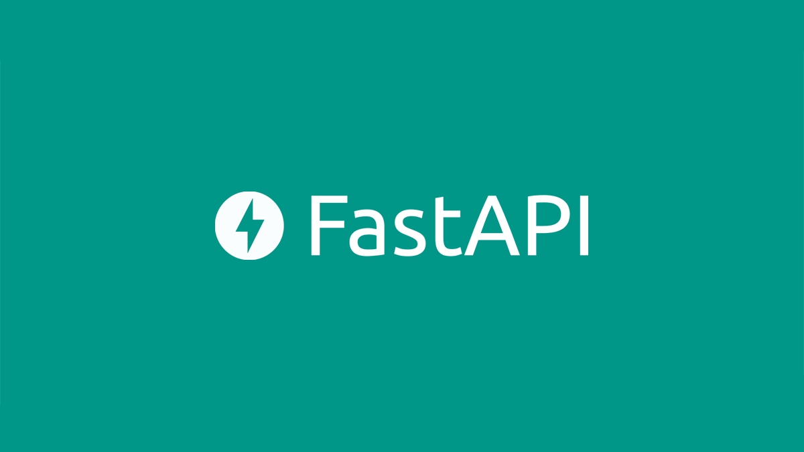

<h1>Utilisation d'une BDD PostgreSQL</h1>

<h3>Date:  09/01/24</h3>
<h3>Referentiel</h3>

[2023] Certification RNCP Développeur.se en intelligence artificielle

<h3>Contexte</h3>

En tant que dev IA, vous serez régulèrement amené à créer une ou plusieurs API Rest dans le cadre de vos projets.
Vous allez réutiliser la base SQLite contenant la data immo comme lors du dernier Brief en ressource.
Vous utiliserez:

FastAPI pour la création de votre API + documentation
Sqlite3 pour vous connecter à la DB et executer des requêtes SQL
Swagger pour tester votre API

<h3>Ressource(s)</h3>
<h5>User Story <a href="https://docs.google.com/spreadsheets/d/110DFqhV0eNhR1mzBkRR5DD6Aey-lgXuTlf3VeSzWD58/edit#gid=0">https://docs.google.com/spreadsheets/d/110DFqhV0eNhR1mzBkRR5DD6Aey-lgXuTlf3VeSzWD58/edit#gid=0</a></h5>
<h5>Doc FastAPI <a href="https://fastapi.tiangolo.com/fr/tutorial/first-steps/">https://fastapi.tiangolo.com/fr/tutorial/first-steps/</a></h5>
<h3>Notes</h3>

Dans le fichier "main.Py' vous retrouverait mon code et l'utilisation de fastapi pour crée un outil permettant aux agents immobiliers d'avoir accées à des données en toute simplicité

</ol>

<h1>                    Merci  

